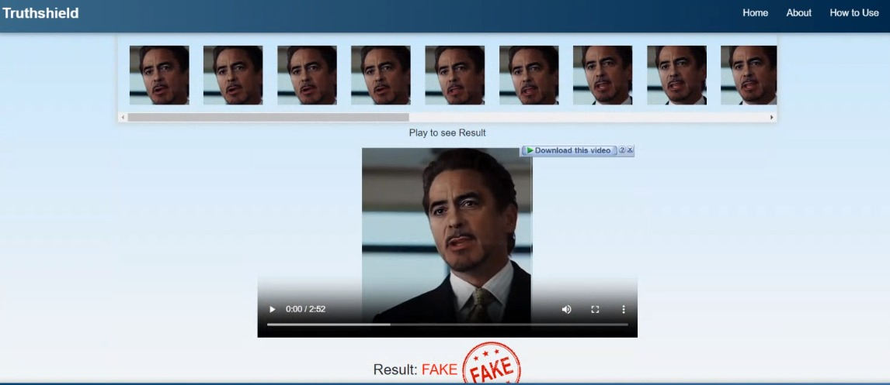
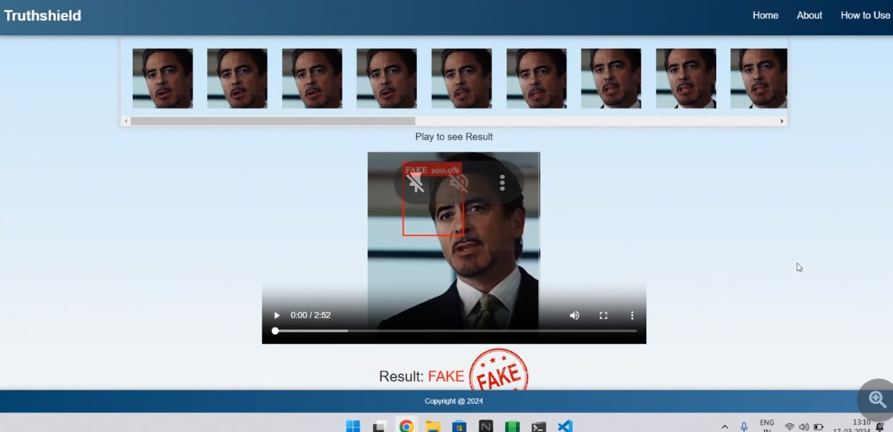

# alphabyte_hackathaon_deepfake_detection
# Deep Fake Detection Django Application

## Overview
This is a Django application designed for detecting deep fake videos using deep learning techniques. It provides a user-friendly interface for uploading videos and images to be analyzed for deep fake content.

### Requirements
- Nvidia GPU with CUDA version 10.0 or higher
- GPU Compute Capability greater than 3.0
- Python 3.6 or later
- Django 3.0 or later

### Directory Structure
Before launching the project, ensure the following directory structure is set up:
- models/
- uploaded_images/
- uploaded_videos/


## Screenshots




### Prerequisites
1. Clone the repository and navigate to the Django application:
```bash

markdown
Copy code
# Deep Fake Detection Django Application

## Overview
This is a Django application designed for detecting deep fake videos using deep learning techniques. It provides a user-friendly interface for uploading videos and images to be analyzed for deep fake content.

### Requirements
- Nvidia GPU with CUDA version 10.0 or higher
- GPU Compute Capability greater than 3.0
- Python 3.6 or later
- Django 3.0 or later

### Directory Structure
Before launching the project, ensure the following directory structure is set up:
- models/
- uploaded_images/
- uploaded_videos/

### Prerequisites
1. Clone the repository and navigate to the Django application:
```bash
git clone https://github.com/abhijitjadhav1998/Deepfake_detection_using_deep_learning.git
Create a virtual environment (optional):

python -m venv venv
Activate the virtual environment (optional):

venv\Scripts\activate

Install requirements:

pip install -r requirements.txt
Copy trained models:
Copy your trained model to the models folder within the Django Application directory.
Running the Application Locally

python manage.py runserver
This command launches the application on your local server.

Model Requirements
The model file must follow the specified format: model_{accuracy}_acc_{frames}_frames_final_data.pt.
The number of frames should be mentioned after three underscores _.
You can download the trained models from the provided Google Drive link.

Note
Ensure appropriate permissions to access directories and required files.
